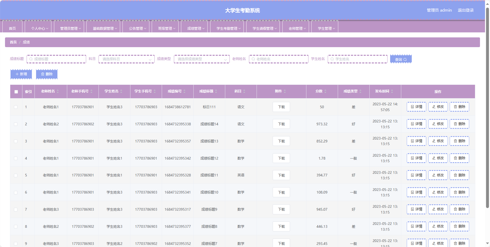

基于Springboot的高校大学生考勤系统（程序+论文）
=
### 完整代码获取地址：从戎源码网 ([https://armycodes.com/](https://armycodes.com/))
### 作者微信：19941326836  QQ：952045282 
### 承接计算机毕业设计、Java毕业设计、Python毕业设计、深度学习、机器学习
### 选题+开题报告+任务书+程序定制+安装调试+论文+答辩ppt 一条龙服务
### 所有选题地址https://github.com/nature924/allProject

一、项目介绍
---
基于Spring Boot框架实现的高校大学生考勤系统的设计与实现，系统包含三种角色：管理员、老师，学生，主要功能如下。
### 【管理员后台功能】

1. 首页：提供管理员进入后台管理的入口。
2. 个人中心：管理员可以管理个人信息。
3. 管理员管理：进行管理员权限的分配和管理。
4. 基础数据管理：管理系统的基础数据。
5. 公告管理：发布、编辑、删除系统通知和公告，及时通知老师和学生。
6. 班级管理：添加、编辑、删除班级信息，包括班级名称、年级等。
7. 成绩管理：记录学生的课堂成绩。
8. 学生考勤管理：查看、编辑、统计学生的考勤信息。
9. 学生请假管理：处理学生的请假申请。
10. 老师管理：进行老师信息的管理。
11. 学生管理：查看、编辑、冻结或删除学生账号。

### 【教师后台功能】

1. 首页：提供教师进入后台管理的入口。
2. 个人中心：教师可以管理个人信息。
3. 公告管理：教师可以查看并参与系统发布的通知和公告。
4. 班级管理：教师可以查看自己所教班级的信息。
5. 成绩管理：录入、查看、编辑学生的课堂成绩信息。
6. 学生考勤管理：查看、编辑、统计学生的考勤情况。
7. 学生请假管理：查看、审批学生的请假申请。
8. 学生管理：查看学生基本信息。

### 【学生后台功能】

1. 首页：提供学生进入后台管理的入口。
2. 个人中心：学生可以管理个人信息。
3. 公告管理：学生可以查看系统发布的通知和公告。
4. 成绩管理：学生可以查看自己的课堂成绩。
5. 学生考勤管理：查看个人的考勤情况。
6. 学生请假管理：学生可以提交请假申请。

二、项目技术
---
- 编程语言：Java
- 数据库：MySQL
- 项目管理工具：Maven
- 前端技术：VUE、HTML、Jquery、Bootstrap
- 后端技术：Spring、SpringMVC、MyBatis

三、运行环境
---
- 操作系统：Windows、macOS都可以
- JDK版本：JDK1.8以上都可以
- 开发工具：IDEA、Ecplise、Myecplise都可以
- 数据库: MySQL5.7以上都可以
- Tomcat：任意版本都可以
- Maven：任意版本都可以

四、运行截图
---
### 论文截图：

### 程序截图：

